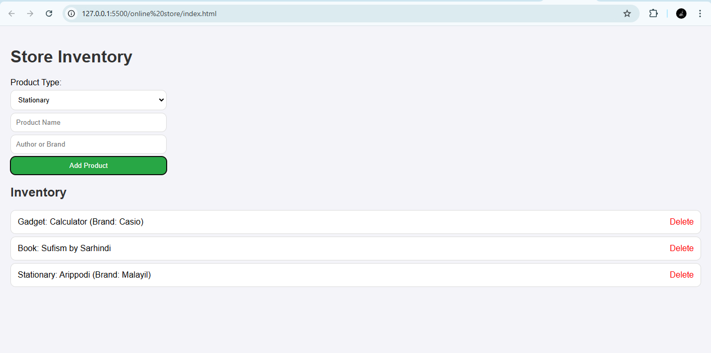

# 🛒 Store Inventory Application

A lightweight **Store Inventory Management System** designed to help users manage products effortlessly. This application allows you to add products to your inventory by specifying their type, name, and additional details.

---

## 🌟 Features

- **Product Management**  
  Add products categorized as **Book**, **Gadget**, or **Stationary**.  

- **Dynamic Inventory List**  
  View the updated inventory list as you add products.  

- **User-Friendly Interface**  
  A clean, simple, and responsive layout for easy navigation.

---

## 🛠️ Technology Stack

- **HTML** - Provides the structure of the app.  
- **CSS** - Styles the interface.  
- **JavaScript** - Handles dynamic functionalities like adding products to the inventory.  

---

# Screenshot



---


## 📂 Folder Structure

```plaintext
store-inventory/
│
├── index.html         # Main HTML file
├── style.css          # CSS file for styling
├── script.js          # JavaScript file for functionality
└── README.md          # Project documentation
